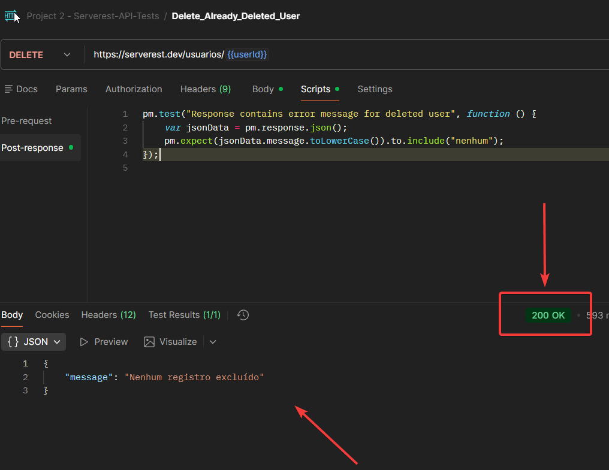

# BUG_API_001 - DELETE returns HTTP 200 when user does not exist

---

**Module:** Users 
**Severity:** Medium  
**Environment:** Serverest API  
**Reported by:** Izabel Souza  
**Date:** 18/10/2025 

---

## Sumario
Ao tentar excluir um usuário que ja foi removido, a API retorna status HTTP **200** mesmo quando ocorre um erro lógico.

---

## Descrição 
Quando é enviado uma requisição para o endpoint DELETE`/usuarios/{userId}`para um usuário que ja foi excluído, a API retorna uma mensagem de erro no corpo da resposta `Nenhum usuário excluido`, porém mantem o status 200 Ok, em vez de retorna um código de erro apropriado como `400(bad request) ou 404(Not Found)`.

---

## Passos para execução
1. Criar um usuário via POST `/usuarios` e salvar Id no environment`userId`.
2. Excluir o usuário via DELETE `/usuarios/{{userId}}`.
3. Executar novamente o mesmo DELETe `/usuarios/{{userId}}`.

---

## Resultado esperado
A API deveria retornar um código HTTP de erro, como 400 ou 404, indicando que o usuario não foi encontrado ou mensagem semelhante.  

---

## Resultado obtido
A API retorna status code `200 OK` com a mensagem: 
> "Nenhum registro excluído"

---

## Impacto
Ferramentas de validação e automação que dependam do status HTTP, não conseguem identificar corretamente o erro podendo gerar falsos positivos.

---

## Evidençias
A resposta da API informa corretamente que não há usuário para excluir, porém o status HTTP retornado é `200 (OK)`, quando deveria ser um código de erro (ex:400 ou 404).

