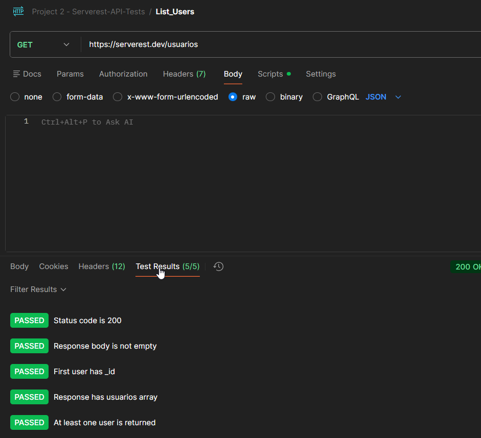

# TC_API_001 - GET-list of users

---

**Module:** Users
**Method:** Get
**Endpoint:** /usuarios
**Priority:** High
**Environment:** Serverest API (https://serverest.dev)
**Date:** 13/01/2026 
**Responsible:** Izabel Souza

---

## Objetivo
Verificar se a API retorna com sucesso a lista de usuários cadastrados.

---

## Passos para execução
1. Configurar uma requisição GET para o endpoint `/usuarios`.
2. Enviar a requisição.
3. Verificar o código de status retornado.
4. Analizar o corpo da resposta em formato JSON.

---

## Resultado esperado
A API deve retornar o status code **200 OK** e uma resposta em formato JSON contendo a lista de usuários cadastrados.

---

## Resultado obtido
A API retornou o status code **200 OK** e a lista de usuários conforme esperado.

---

## Status
🟢 PASS

---

## Evidências
Execução da requisição no Postman, incluindo validação do status da resposta e testes automatizados via scripts.
