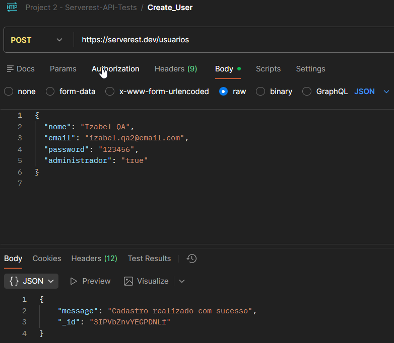

# TC_API_002 - POST-Create User

---

**Module:** Users
**Method:** POST
**Endpoint:** /usuarios
**Priority:** High
**Environment:** Serverest API(https://serverest.dev)
**Date:** 14/01/2026 
**Responsible:** Izabel Souza

---

## Objetivo
Verificar se a API permite criar um novo usuário com dados válidos.

---

## Passos para execução
1. Configurar uma requisição POST para o endpoint `/usuarios`.
2. Informar no corpo da requisição dados válidos de um novo usuário.
3. Enviar a requisição.
4. Verificar o código de status retornado.
4. Analizar a resposta da API.

---

## Resultado esperado
A API deve retornar o status code **201 Created** e confirmar a criação do novo usuário.

---

## Resultado obtido
A API retornou o status **201 Created** e confirmou a criação do novo usuário conforme esperado.

---

## Status
🟢 PASS

---

## Evidências
Execução da requisição no Postman, incluindo validação do status da resposta.
