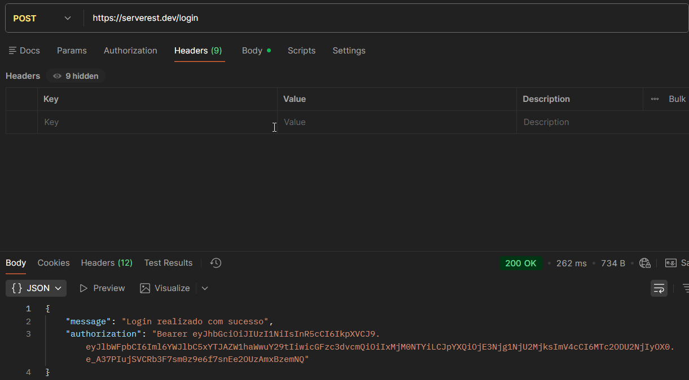

# TC_API_004 - POST-Login User (generate token)

---

**Module:** Authentication
**Method:** POST
**Endpoint:** /login
**Priority:** high
**Environment:** Serverest API(https://serverest.dev)
**Date:** 14/01/2026 
**Responsible:** Izabel Souza

---

## Objetivo
Verificar se a API permite autenticar um usuário cadastrado e retorna um token de acesso.

---

## Passos para execução
1. Configurar uma requisição POST para o endpoint `/login`.
2. Informar no corpo da requisição um email e senha válidos.
3. Enviar a requisição.
4. Verificar o código de status retornado.
4. Validar a presença do token na resposta.

---

## Resultado esperado
A API deve retornar o status code **200 OK** e fornecer um token de autenticação válido.

---

## Resultado obtido
A API retornou o status **200 OK** e forneceu um token de autenticação conforme esperaado.

---

## Status
🟢 PASS

---

## Evidências
Execução da requisição no Postman, incluindo validação do status da resposta.
