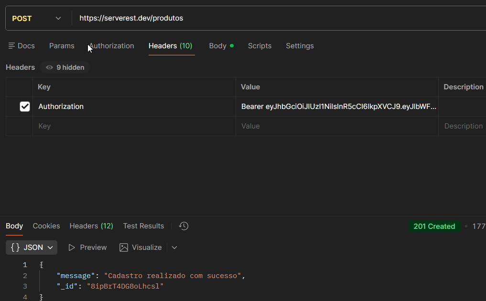

# TC_API_005 - POST-Create prduct with authentication

---

**Module:** Product
**Method:** POST
**Endpoint:** /Produtos
**Priority:** high
**Environment:** Serverest API(https://serverest.dev)
**Date:** 14/01/2026 
**Responsible:** Izabel Souza

---

## Objetivo
Verificar se a API permite criar um produto quando o usuário estiver autenticado.

---

## Passos para execução
1. Autenticar um usuário válido para obter um token.
2. Configurar uma requisição POST para o endpoint `/produtos`.
3. Informar o token no header authorization.
4. Enviar a requisição com dados válidos do produto.
5. Verificar o código de status e a resposta da API.

---

## Resultado esperado
A API deve retornar o status code **201 created** e informar a criação do produto.

---

## Resultado obtido
A API retornou o status **201 created** e confirmou a criação do produto conforme esperado.

---

## Status
🟢 PASS

---

## Evidênciias
Execução da requisição no Postman, incluindo validação do status da resposta.
.