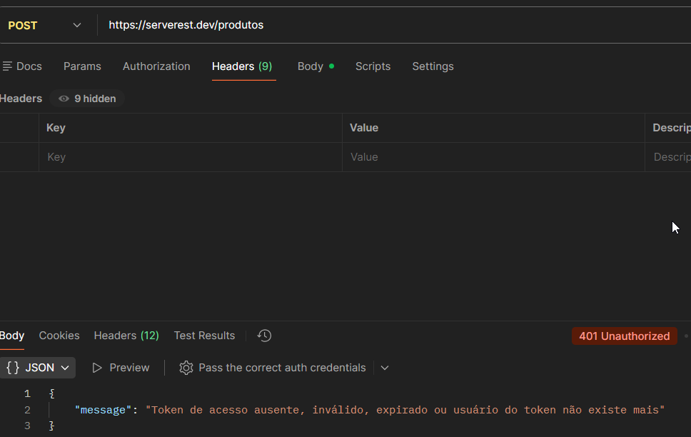

# TC_API_006 - POST-Create product without authentication

---

**Module:** Product
**Method:** POST
**Endpoint:** /Produtos
**Priority:** high
**Environment:** Serverest API
**Date:** 14/01/2026 
**Responsible:** Izabel Souza

---

## Objetivo
Verificar se a API bloqueia a criação de produtos quando o usuário não está autenticado.

---

## Passos para execução

1. Configurar uma requisição POST para o endpoint `/produtos` sem informar o token.
2. Enviar a requisição com dados válidos do produto.
3. Verificar o código de status retornado.
4. Analisar a mensagem de erro apresentada.
---

## Resultado esperado
A API deve retornar o status code **401 Unauthorized** informando que o acesso não é permitido.

---

## Resultado obtido
A API retornou o status **401 Unauthorized**, bloqueando a criação do produto conforme esperado.

---

## Status
🟢 PASS

---

## Evidências
Execução da requisição no Postman, incluindo validação do status da resposta.
.
