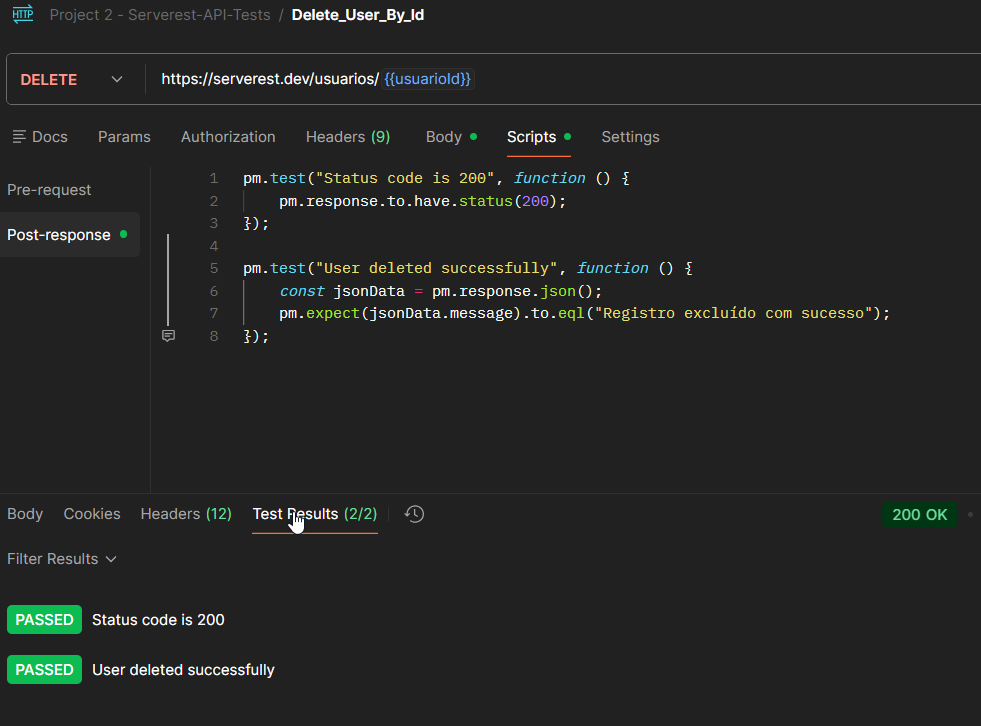

# TC_API_008 - DELETE User By Id

---

**Module:** Users
**Method:** DELETE
**Endpoint:** /usuarios
**Priority:** High
**Environment:** Serverest API(https://serverest.dev)
**Date:** 15/01/2026 
**Responsible:** Izabel Souza

---

## Objetivo
Verificar se a API permite deletar um usuário já existente utiliznado seu Id.

---

## Pré condição
Usuário existente com Id salvo na váriavel de ambiente.

---

## Passos para execução
1. Configurar uma requisição DELETE para o endpoint `/usuarios/{{userId}}`.
2. Enviar a requisição.
3. Verificar o código de status retornado e se o usuario foi deletado como esperado.

---

## Resultado esperado
A API deve retornar o status code **200 OK** e confirmar a exclusão do usuário.

---

## Resultado obtido
A API retornou o status **200 OK** e confirmou queo usuário foi exluido com sucesso.

---

## Status
🟢 PASS

---

## Evidências
Execução da requisição DELETE no Postman, incluindo validação do status code, mensgem de resposta e testes automatizados por scripts.

