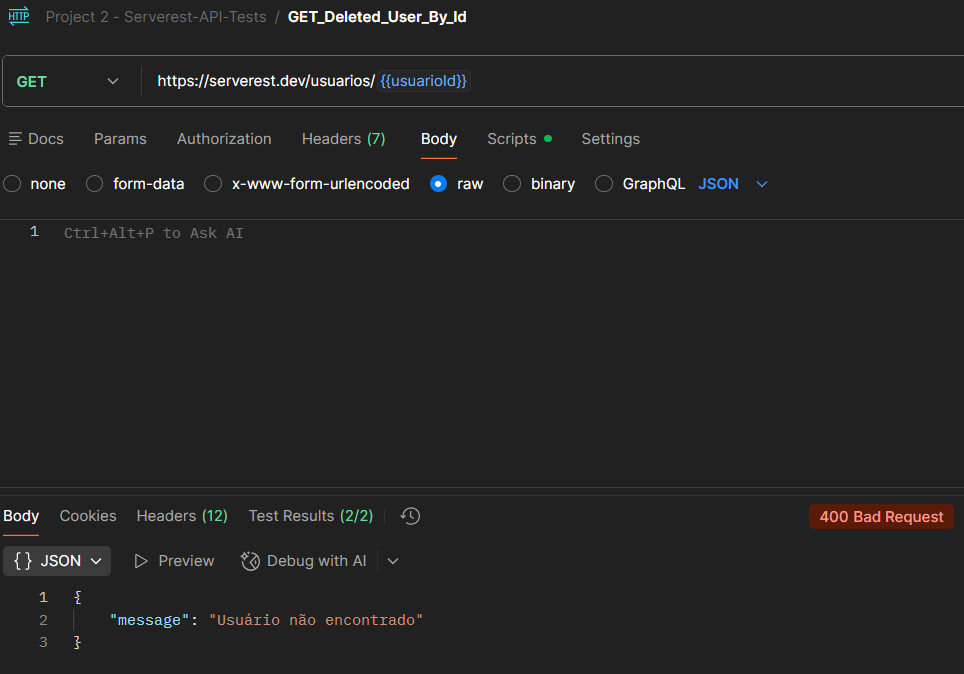
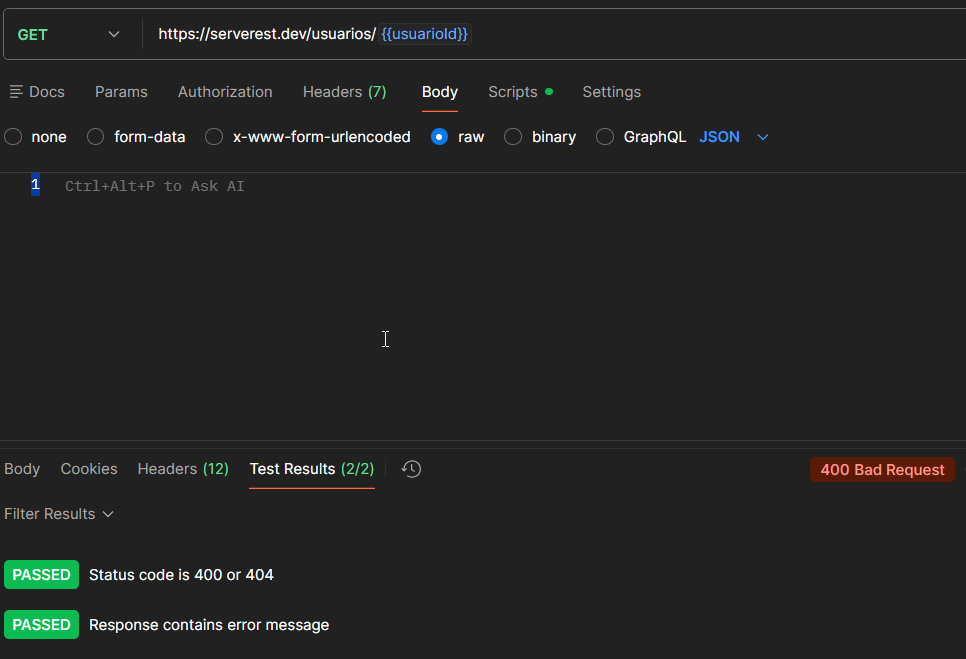

# TC_API_009 - GET Deleted User By Id

---

**Module:** Users
**Method:** GET
**Endpoint:** /usuarios
**Priority:** Medium
**Environment:** Serverest API(https://serverest.dev)
**Date:** 15/01/2026 
**Responsible:** Izabel Souza

---

## Objetivo
Verificar se a API não retorna dados ao tentar consultar um usuário previamente excluido.

---

## Pré condição
1. Um usuário precisa ter sido criado previamente.
2. Esse usuário deve ter sido excluido.
3. UserId ainda esteja salvo no environment.

---

## Passos para execução
1. Configurar uma requisição Get para o endpoint `/usuarios/{{userId}}`.
2. Enviar a requisição.
3. Verificar o código de status e mensagem retornada.

---

## Resultado esperado
A API deve retornar o status code **400 Bad Request** e mensagem de `Usuário não encotrado`.

---

## Resultado obtido
A API retornou o status **400 Bad Request** e confirmou que o usuário não foi encotrado.

---

## Status
🟢 PASS

---

## Evidências
Execução da requisição GET no Postman, incluindo validação do status code, mensagem de resposta e testes automatizados por scripts.

