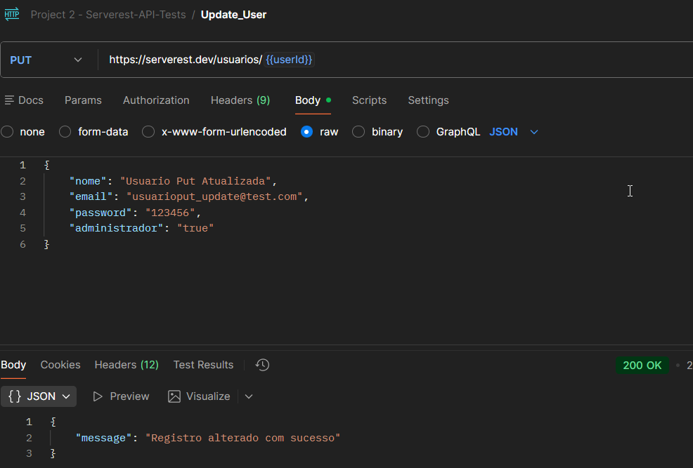
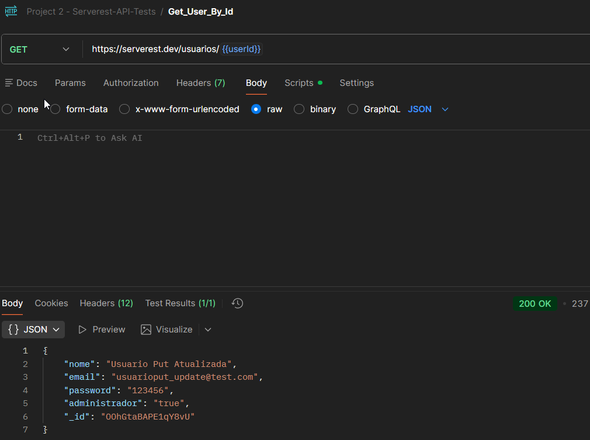
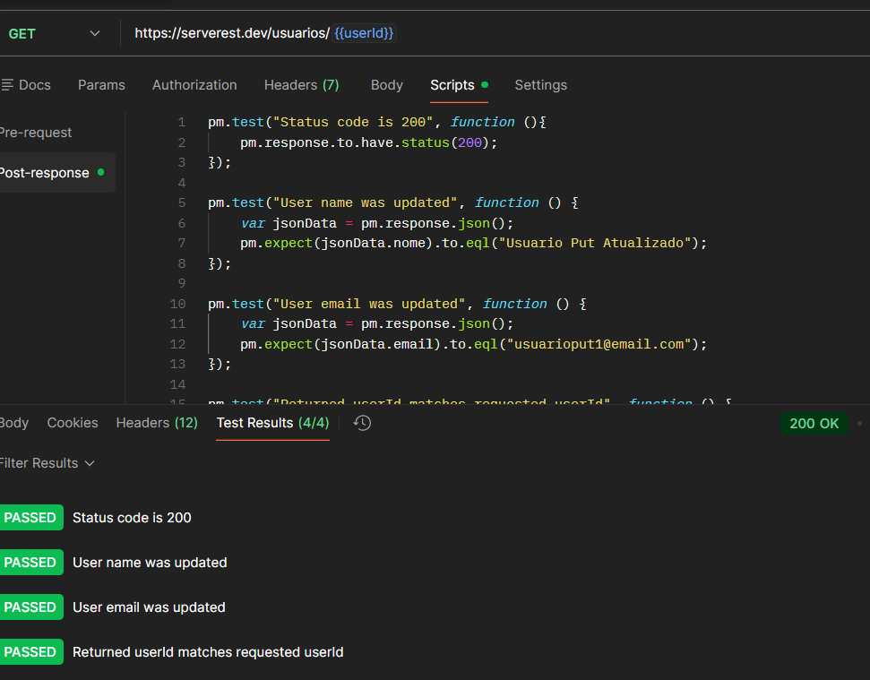

# TC_API_010 - PUT Update User

---

**Module:** Users
**Method:** PUT
**Endpoint:** /usuarios
**Priority:** High
**Environment:** Serverest API(https://serverest.dev)
**Date:** 20/01/2026 
**Responsible:** Izabel Souza

---

## Objetivo
Verificar se a API permite atualização de um usuário já existente.

---

## Pré condições
- API Serverest disponível. 
- Usuário criado previamente via POST.  
- Variável `userId` salva no Environment.

---

## Passos para execução
1. Configurar uma requisição **POST-Create User** para o endpoint `/usuarios`salvando o UserId na environment.
2. Confirmar que o `userId` foi salvo corretamente na environment.
3. Configurar uma requisição PUT para o endpoint `/usuarios/{{userId}}`.
4. No body da requisição informar as alterações a serem feitas.
5. Executar requisição.
6. Verificar se os dados retornados refletem as alterações feitas no PUT.
7. Na requisição GET validar dados atualizados do usuario via `userId`.

---

## Resultado esperado
A API deve retornar o status code **200 OK** com a mensagem:**Registro alterado com sucesso** e o GET deve apresentar os dados do usuário atualizados.

---

## Resultado obtido
A API retornou o status **200 OK** Seguido de mensagem de confirmação e o GET  confirmou que os dados do usuário foram atualizados corretamente.

---

## Status
🟢 PASS

---

## Evidências
Execução da requisição PUT e GET no Postman, incluindo validação do status da resposta.

