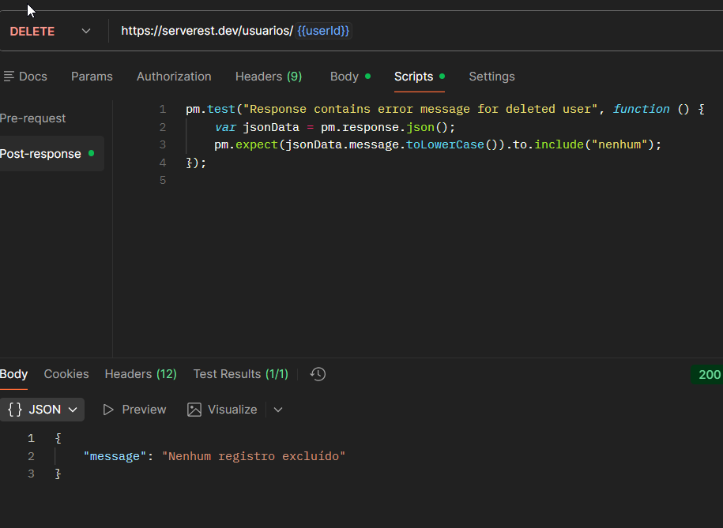
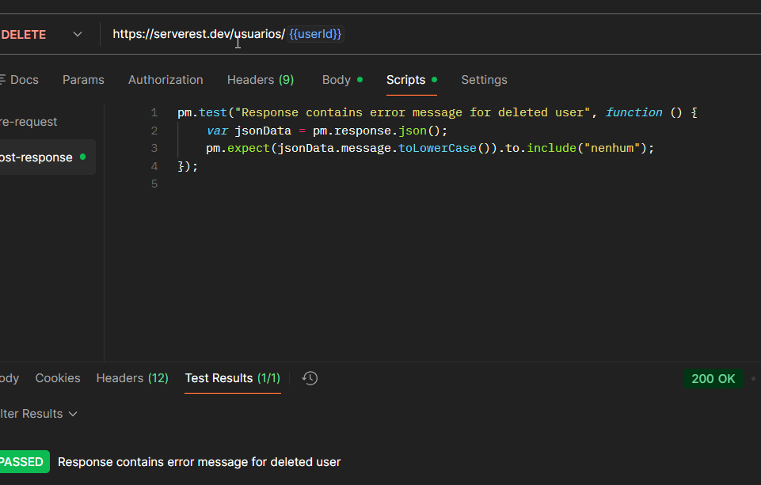

# TC_API_011 - DELETE Already Deleted User 

---

**Module:** Users
**Method:** DELETE
**Endpoint:** /usuarios
**Priority:** Medium
**Environment:** Serverest API(https://serverest.dev)
**Date:** 17/01/2026 
**Responsible:** Izabel Souza

---

## Pre-condition
Usuário existente previamente criado e depois excluído.

---

## Objetivo
Verificar o comportamento da API ao tentar exluir um usuario previamente deletado do sistema.

---

## Passos para execução
1. Configurar uma requisição DELETE para o endpoint `/usuarios/{{userId}}`.
2. Enviar a requisição e confirmar mensagem de sucesso.
3. Enviar novamente a mesma requisição DELETE pa o mesmo UserId.
4. Verificar mensagem de erro.

---

## Resultado esperado
A API deve informar mensagem de que "nenhum registro foi excluído".

---

## Resultado obtido
A API retornou o status **200 OK** e mensagem de confirmação: `Nenhum registro excluído`.

---

## Status
🟢 PASS

---

## Evidências
Execução da requisição DELETE no Postman, incluindo testes automatizados por scripts.

