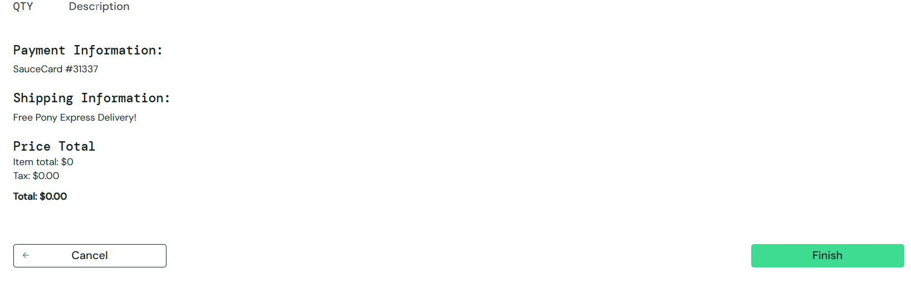
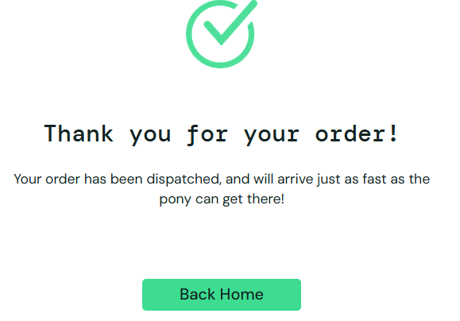

## BUG002 - Permitido concluir compra sem itens adicionados ao carrinho

---

**Modulo:** Checkout  
**Severidade:** alta
**Prioridade:** alta  
**Ambiente:** Chrome – Windows 11  
**Versão do sistema:** 1.0  
**Reportado por:** Izabel Souza  
**Data:** 21/10/2025  

---

## Descrição
O sistema permite que o usuário prossiga para o checkout e conclua um pedido, mesmo quando nenhum item foi adicionado ao carrinho de compras.

---

## Passos para execução
1. Acessar o site https://www.saucedemo.com  
2. Realizar login com usuário válido 
3. Clicar no ícone do carrinho.
4. Não add nenhum produto ao carrinho.
5. Clicar no botão `checkout`.
6. Preencher as informações de finalização de compra necessária.
7. Clicar em `continue`.
8. Clicar no botão `finish`

---

## Resultado esperado 
O sistema deve impedir o usuário de prosseguir para o pagamento quando o carrinho estiver vazio e exibir uma mensagem informando que pelo menos um produto deve ser adicionado ao carrinho.

---

## Resultado obtido
O sistema permite que o processo de finalização de compra continue e exibe mensagem de conclusão do pedido mesmo com o carrinho de compras vazio.

---

## Impacto
Este problema permite que pedidos inválidos sejam conclúidos, o que pode comprometer a integridade do pedido e não reflete um fluxo de compra realista.

---

## Evidência

