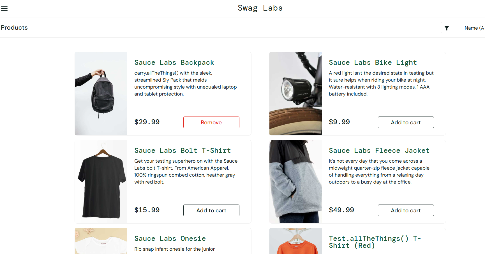

# CT001 - Login com credenciais válidas

---

**Módulo:** Login  
**Prioridade:** Alta  
**Pré-condição:** Site acessível, credenciais válidas  
**Versão do sistema:** 1.0   
**Data:**     
**Responsável:** <Izabel Souza >

---

## Objetivo

Validar se o site permite o login quando usuário insere credenciais válidas.

---

## Passos para execução

1. Acessar o site [SauceDemo](https://www.saucedemo.com/).
2. Inserir **username**: `standard_user`.
3. Inserir **password**: `secret_sauce`.
4. Clicar em **login**.
5. Sistema redireciona para página de produtos.

---

## Resultado esperado
O sistema deve autenticar o usuário com sucesso e exibir a pagina de **Produtos** com itens disponíveis.

---

## Resultado obtido
Login realizado com sucesso e sistema redirecionou corretamente para a página de produtos.

---

## Status

🟢*PASS*

---

## Evidência da execução

<!-- "!" indica que é uma imagem.[CT001_login_valid] é o texto alternativo(aparece se a imagem não carregar) 
 (../evidence/CT001_login_valid.png) é o caminho relativo até a imagem "..7" significa: voltar uma pasta para cima-- >

