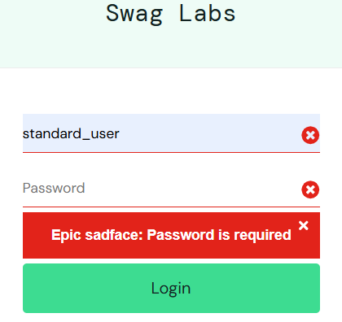

# CT005 - Login sem senha

---

**Módulo:** Login  
**Prioridade:** média   
**Pré-condição:** Site acessível, inserir usuário de teste disponível:`standard_user` 
**Versão do sistema:** 1.0     
**Data:** 21/10/2025         
**Responsável:** Izabel Souza

---

## Objetivo
Verificar se o sistema impede o login de usuário com campo de senha vazio.

---

## Passo para execução
1. Acessar a página de login: [SauceDemo](https://www.saucedemo.com/).
2. Inserir o **username**:  `standard_user` 
3. Deixar campo **password** em branco.
4. Clicar no botão **login**.
5. Observar a mensagem exibida.

---

## Resultado esperado
O sistema deverá exibir a mensagem: "Epic sadface: Password is required"

---

## Resultado obtido
O sistema exibiu corretamente a mensagem: `Epic sadface: Password is required`

---

## Status
🟢*PASS*

---

## Evidências
