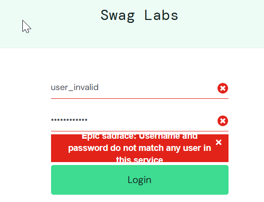

# CT005 - Login com usuário inexistente

---

**Módulo:** Login  
**Prioridade:** Alta  
**Pré-condição:** Site acessível, inserir credênciais inválidas. 
**Versão do sistema:** 1.0     
**Data:** 21/10/2025         
**Responsável:** <Izabel Souza>

---

## Objetivo
Verificar se o sistema exibe mensagem de erro adequada quando usuário inserir credenciais inválidas.

---

## Passo para execução
1. Acessar a página de login: [SauceDemo](https://www.saucedemo.com/).
2. Inserir o **username**: `user_invalid`.
3. Deixar campo **password**: `secret_sauce`.
4. Clicar no botão **login**.
5. Observar a mensagem exibida.

---

## Resultado esperado
O sistema deverá exibir a mensagem: "Epic sadface: Username and password do not match any user in this service"

---

## Resultado obtido
O sistema exibiu corretamente a mensagem: `Epic sadface: Username and password do not match any user in this service`
---

## Status
🟢*PASS*

---

## Evidências
