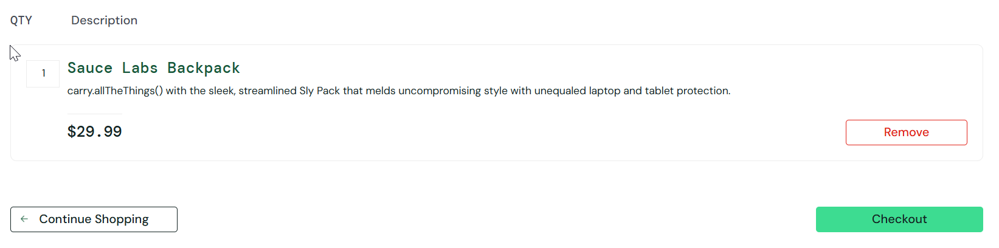

# CT007 - Adicionar produto ao carrinho

---

**Módulo:** Carrinho de  compras  
**Prioridade:** Alta  
**Pré-condição:** site *Saucedemo* acessível e usuário logado com credenciais válidas. 
**Versão do sistema:** 1.0     
**Data:** 21/10/2025         
**Responsável:** <Izabel Souza>

---

## Objetivo
Verificar se o sistema adiciona corretamente um produto ao carrinho de compras.

---

## Passo para execução
1. Acessar a página de login: [SauceDemo](https://www.saucedemo.com/).
2. Realizar login com usuário: `standard_user` e senha: `secret_sauce`. 
3. Na aba de *Produtos*, selecionar um item e add ao carrinho. Ex: item ( **Sauce Labs Backpack** ).
4. Clicar no botão **Add to cart**.
5. Clicar no ícone do carrinho no canto superior direito.
6. Verificar se o item **Sauce Labs Backpack** foi add corretamente ao carrinho.

---

## Resultado esperado
O produto **Sauce Labs Backpack** deve aparecer listado na página do carrinho, com a quantidade **1** e preço correspondente.

---

## Resultado obtido
O produto foi adicionado corretamente ao carrinho de compras.
---

## Status
🟢*PASS*

---

## Evidências
