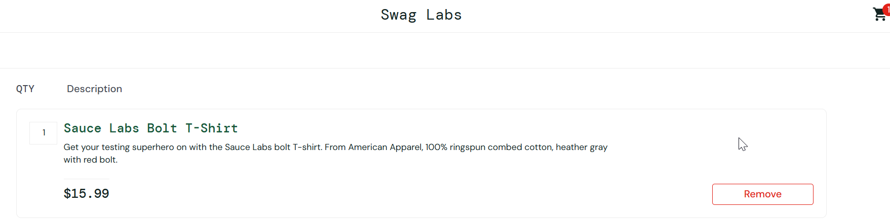
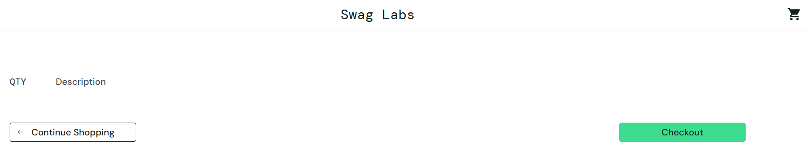

# CT008 - Remover produto do carrinho

---

**Módulo:** Carrinho de  compras  
**Prioridade:** Média  
**Pré-condição:** Usuário logado com credenciais válidas e pelo menos um item adicionado ao carrinho. 
**Versão do sistema:** 1.0     
**Data:** 21/10/2025         
**Responsável:** < Izabel Souza >

---

## Objetivo
Verificar se o sistema remove corretamente um produto do carrinho de compras.

---

## Passo para execução
1. Acessar a página de login: [SauceDemo](https://www.saucedemo.com/).
2. Realizar login com usuário: `standard_user` e senha: `secret_sauce`. 
3. Na aba de *Produtos*, adicionar pelo menos um produto ao carrinho.
4. Clicar no ícone do carrinho no canto superior direito.
5. Clicar em *Remove* no produto adicionado.
6. Verificar se o produto foi removido corretamente do carrinho.

---

## Resultado esperado
O produto removido não deve mais aparecer na lista do carrinho e contador do carrinho diminuir adequadamente.

---

## Resultado obtido
O produto foi removido corretamente do carrinho de compras e lista atualizada.

---

## Status
🟢*PASS*

---

## Evidências

