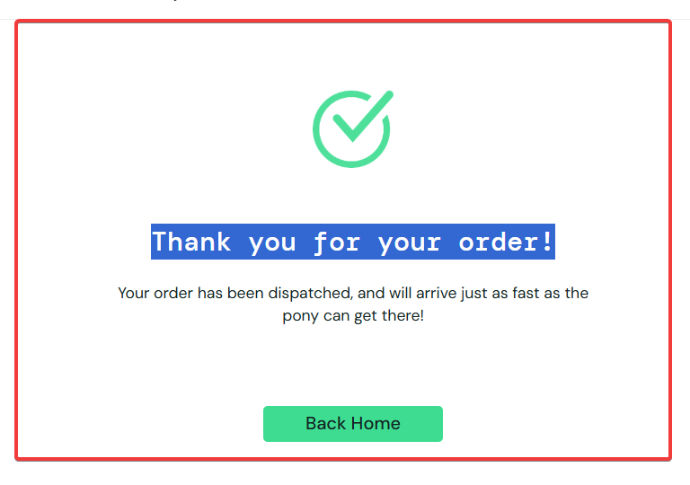

# CT009 - Finalizar compra com dados completos

---

**Módulo:** Carrinho de compras    
**Prioridade:** Alta    
**Pré-condição:** Usuário logado com credenciais válidas e pelo menos um item adicionado ao carrinho.   
**Versão do sistema:** 1.0     
**Data:** 21/10/2025   
**Responsável:** < Izabel Souza >   

 ---
 
## Objetivo
Verificar se o sistema finaliza corretamente a compra de pelo menos um produto.

---

## Passo para execução
1. Acessar a página de login: [SauceDemo](https://www.saucedemo.com/).
2. Realizar login com usuário: standard_user e senha: secret_sauce. 
3. Na aba de *Produtos*, adicionar pelo menos um produto ao carrinho. 
4. Clicar no ícone do carrinho no canto superior direito. 
5. Clicar em *checkout*. 
6. Prencher os campos *First Name, Last Name, Postal Code*. 
7. Conferir o resumo do pedido. 
8. clicar em *Finish* 
9. Verificar mensagem de conclusão da compra: *Thank you for your order!*

---

 ## Resultado esperado
O sistema deve finalizar a compra com sucesso e exibir a mensagem:*“Thank you for your order!”* e exibir o botão "Back Home".

---

 ## Resultado obtido
O sistema concluiu a compra e exibiu a mensagem *“Thank you for your order!”* conforme esperado. 

--- 

## Status 
🟢*PASS* 

---

## Evidências
.