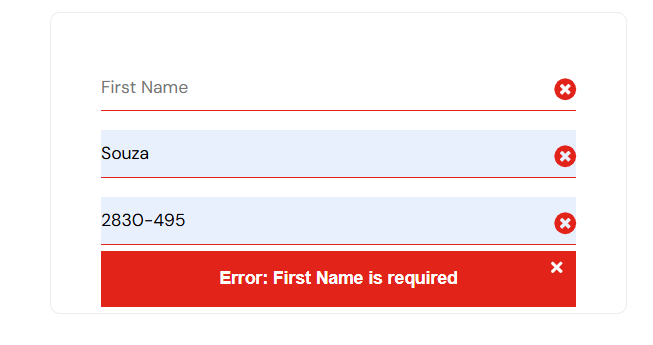
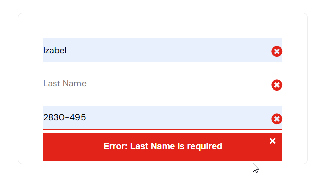
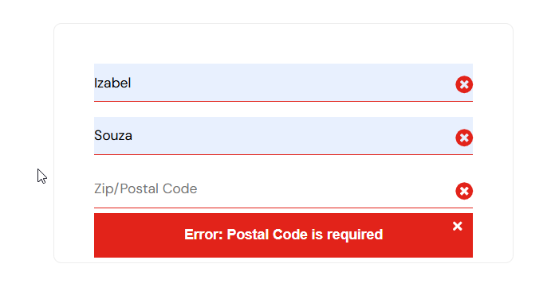

# CT010 - Validação de campos obrigatórios no checkout

---

**Módulo:** Carrinho de  compras  
**Prioridade:** Média
**Pré-condição:** Usuário logado com credenciais válidas e pelo menos um item adicionado ao carrinho. 
**Versão do sistema:** 1.0     
**Data:** 21/10/2025         
**Responsável:** < Izabel Souza >

---

## Objetivo
Verificar se o sistema valida corretamente os campos obrigatórios no checkout quando não são preenchidos.

---

## Passo para execução

### Cenário 1 – First Name em branco
1. Acessar a página de login: [SauceDemo](https://www.saucedemo.com/).
2. Realizar login com usuário: `standard_user` e senha: `secret_sauce`. 
3. Na aba de *Produtos*, adicionar pelo menos um produto ao carrinho.
4. Clicar no ícone do carrinho no canto superior direito.
5. Clicar em *checkout*.
6. Deixar o campo *first name* em branco.
7. Prencher os campos: Last Name, Postal Code*.
8. Conferir o resumo do pedido.
9. clicar em *continue*
10. Verificar mensagem de erro exibida.

---

### Cenário 2 – Last Name em branco
1. Retornar para a tela de checkout.
2. Prencher o campo *First name*.
3. Deixar o campo *Last name* em branco.
4. Prencher o campo *Postal code*.
5. Clicar em continue.
6. Verificar mensagem de erro exibida.

---

### Cenário 3 – Postal Code em branco
1. Retornar para a tela de checkout.
2. Preencher os campos *First Name* e *Last Name*.
3. Deixar o campo *Postal Code* em branco.
4. Clicar em *Continue*.
5. Verificar a mensagem de erro exibida.

## Resultado esperado
O sistema deverá exibir mensagens de validação informando que os campos são obrigatórios:

- Para *First Name* vazio: *“Error: First Name is required”* 
- Para *Last name* vazio: *"Error: Last name is required"*
- Para *Postal code* vazio: *"Error: Postal code is required"*

---

## Resultado obtido
O sistema exibiu corretamente as mensagens de validção para todos os campos obrigatórios conforme esperado.

---

## Status
🟢*PASS*

---

## Evidências 

