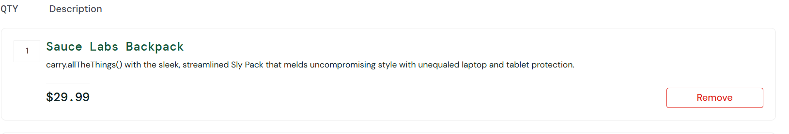

# BUG001 - Não é possivel add mais de uma unidade do mesmo produto ao carrinho

---

**Módulo:** Carrinho de compras  
**Severidade:** Média  
**Prioridade:** Média  
**Ambiente:** Chrome – Windows 11  
**Versão do sistema:** 1.0  
**Reportado por:** Izabel Souza  
**Data:** 21/11/2025 

---

## Descrição 
Ao selecionar um produto e adicioná-lo ao carrinho, o sistema não permite adicionar mais de uma unidade do mesmo item. O botão `add to cart` é substituido por `remove` o que impossibita o ajuste da quantidade do produto.

---

## Passo para execução
1. Acessar o site https://www.saucedemo.com  
2. Realizar login com usuário válido 
3. Selecionar um produto da lista ( ex: `Sauce Lab Backpack`).
4. Clicar no botão `add to cart`.
5. tentar adicionar novamente o mesmo produto ao carrinho.

---

## Resultado esperado
O sistema deveria deixar o usuário adicionar mais de uma unidade do mesmo produto ao carrinho de compras.

---

## Resultado obtido
Quando adicionado um produto ao carrinho o botão `add to cart` é substituido por `remove` e é adicionado um item ao carrinho. Após isso, o usuário não consegue alterar a quantidade do produto selecionado, limitando-o a comprar apenas um item por compra. 

---

## Impacto
O usúario não consegue comprar mais de uma unidade do mesmo produto. O que limita a experiência da compra e pode impedir a conclusão de múltiplas quantidades do mesmo item.

---

## Evidência

